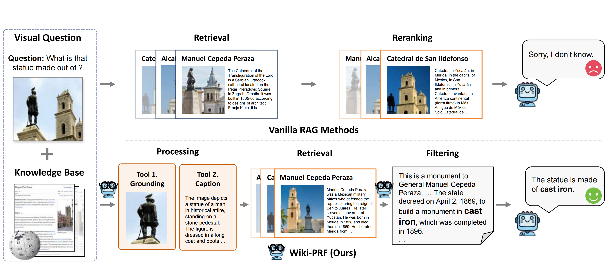

# Knowledge-based-Visual-Question-Answering-with-Multimodal-Processing-Retrieval-and-Filtering
[](https://arxiv.org/abs/2510.14605)
[]([https://icml.cc/](https://neurips.cc/))
[](https://www.python.org/downloads/)
[](https://pytorch.org/)

This repository provides the official PyTorch implementation for Wiki-PRF, a novel three-stage method for Knowledge-Based Visual Question Answering (KB-VQA). Wiki-PRF consists of Processing, Retrieval, and Filtering stages that dynamically extract multimodal cues, perform joint visual-text knowledge retrieval, and filter irrelevant results. The paper has been accepted at NeurIPS 2025.

## 🪵 TODO List

- ✅ Release core implementation
- ✅ Complete README documentation
- 🔄 Add configuration examples
- 🔄 Add More detailed Quick Start.

## 🔥 What's New

- **(2025.9.19)** 🎉 Our paper (Wiki-PRF) is accepted as **Neurlps 2025**!
- **(2025.10.17)** 📄 Paper released on arXiv

# 🧠 Wiki-PRF: A Three-Stage Framework for Knowledge-Based Visual Question Answering

> Official PyTorch implementation of Wiki-PRF, accepted at NeurIPS 2025.

  
*Wiki-PRF achieves state-of-the-art results on KB-VQA benchmarks.*

---

## 📌 Abstract

Knowledge-based visual question answering (KB-VQA) requires models to combine visual understanding with external knowledge. While retrieval-augmented generation (RAG) helps, it often suffers from poor multimodal queries and noisy retrieved content.  

We propose **Wiki-PRF**, a three-stage framework:

- 🔍 **Processing**: Dynamically invokes visual tools to extract precise multimodal cues for querying.  
- 📚 **Retrieval**: Integrates visual and text features to retrieve relevant knowledge.  
- 🧹 **Filtering**: Filters out irrelevant or low-quality results using reinforcement learning rewards based on answer accuracy and format consistency.

Our method significantly improves performance on E-VQA and InfoSeek, achieving new state-of-the-art results.

---

## 🏗️ Architecture


Our framework consists of three main components:

1. **🔍 Processing Module**  
   Uses vision-language tools to generate accurate, grounded queries for knowledge retrieval.

2. **📚 Multimodal Retrieval Module**  
   Combines image and text embeddings to retrieve top-k relevant passages from a knowledge base.

3. **🧹 Filtering & Refinement Module**  
   Applies RL-based filtering to discard noisy context and refine the final answer generation.

---

## 📊 Results

## 📊 Main Results on E-VQA and InfoSeek

*All values are accuracy (%). Best results in **bold**, second best <u>underlined</u>.*

### Zero-shot MLLMs
| Method                              | Model               | Retriever | E-VQA (Single-Hop) | E-VQA (All) | InfoSeek (Unseen-Q) | InfoSeek (Unseen-E) | InfoSeek (All) |
|------------------------------------|---------------------|-----------|---------------------|-------------|----------------------|----------------------|----------------|
| BLIP-2               | Flan-T5<sub>XL</sub> | –         | 12.6                | 12.4        | 12.7                 | 12.3                 | 12.5           |
| InstructBLIP | Flan-T5<sub>XL</sub> | –         | 11.9                | 12.0        | 8.9                  | 7.4                  | 8.1            |
| LLaVA-v1.5      | Vicuna-7B           | –         | 16.3                | 16.9        | 9.6                  | 9.4                  | 9.5            |
| GPT-4V           | –                   | –         | 26.9                | 28.1        | 15.0                 | 14.3                 | 14.6           |
| Qwen2.5-VL-3B (Base) | –                 | –         | 17.9                | 19.6        | 20.4                 | 21.9                 | 21.4           |
| Qwen2.5-VL-7B (Base)  | –                 | –         | 21.7                | 20.3        | 22.8                 | 24.1                 | 23.7           |

### Retrieval-Augmented Models
| Method                     | Model                    | Retriever               | E-VQA (Single-Hop) | E-VQA (All) | InfoSeek (Unseen-Q) | InfoSeek (Unseen-E) | InfoSeek (All) |
|---------------------------|--------------------------|-------------------------|---------------------|-------------|----------------------|----------------------|----------------|
| DPR<sub>V+T</sub>  | Multi-passage BERT   | CLIP ViT-B/32           | 29.1                | –           | –                    | –                    | 12.4           |
| RORA-VLM  | Vicuna-7B              | CLIP + Google Search    | –                   | 20.3        | 25.1                 | 27.3                 | –              |
| EchoSight | Mistral-7B / LLaMA-3-8B | EVA-CLIP-8B           | 19.4                | –           | –                    | –                    | 27.7           |
| Wiki-LLaVA  | Vicuna-7B            | CLIP ViT-L/14 + Contriever | 17.7             | 20.3        | 30.1                 | 27.8                 | 28.9           |
| ReflectiVA | LLaMA-3.1-8B       | EVA-CLIP-8B             | 28.0                | 29.2        | 40.4                 | 39.8                 | 40.1           |
| MMKB-RAG    | LLaMA-3.1-8B            | EVA-CLIP-8B             | **39.7**            | 35.9        | 36.4                 | 36.3                 | 36.4           |
| VLM-PRF (w/o RL)           | Qwen-2.5VL-3B           | EVA-CLIP-8B             | 26.6                | 25.6        | 34.2                 | 33.7                 | 34.0           |
| VLM-PRF (w/o RL)           | Qwen-2.5VL-7B           | EVA-CLIP-8B             | 28.9                | 28.6        | 40.0                 | 39.4                 | 39.5           |

### Retrieval-Augmented Models with Reinforcement Learning (Ours)
| Method            | Model             | Retriever       | E-VQA (Single-Hop) | E-VQA (All) | InfoSeek (Unseen-Q) | InfoSeek (Unseen-E) | InfoSeek (All) |
|-------------------|-------------------|-----------------|---------------------|-------------|----------------------|----------------------|----------------|
| VLM-PRF (**Ours**) | LLaMA-3.1-8B     | EVA-CLIP-8B     | 36.3                | 35.5        | 41.3                 | 40.6                 | 40.8           |
| VLM-PRF (**Ours**) | Qwen-2.5VL-3B    | EVA-CLIP-8B     | 31.1                | 32.4        | 39.7                 | 38.8                 | 39.0           |
| VLM-PRF (**Ours**) | Qwen-2.5VL-7B    | EVA-CLIP-8B     | 37.1                | **36.0**    | **43.3**             | **42.7**             | **42.8**       |
| VLM-PRF (**Ours**) | InternVL3-8B     | EVA-CLIP-8B     | **40.1**            | **39.2**    | **43.5**             | <u>42.1</u>          | <u>42.5</u>    |

## 🚀 Get Started

```bash
git clone https://github.com/yourname/wiki-prf.git
cd wiki-prf
pip install -r requirements.txt
